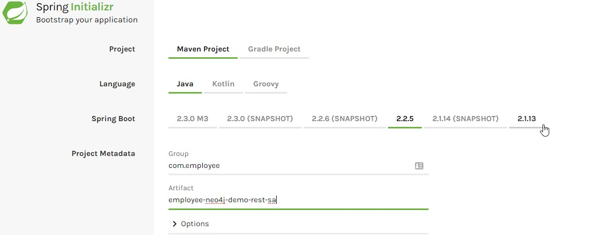
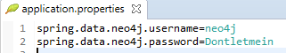
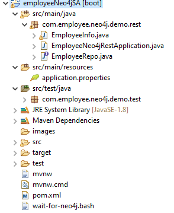
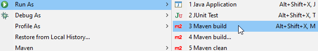
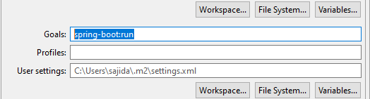
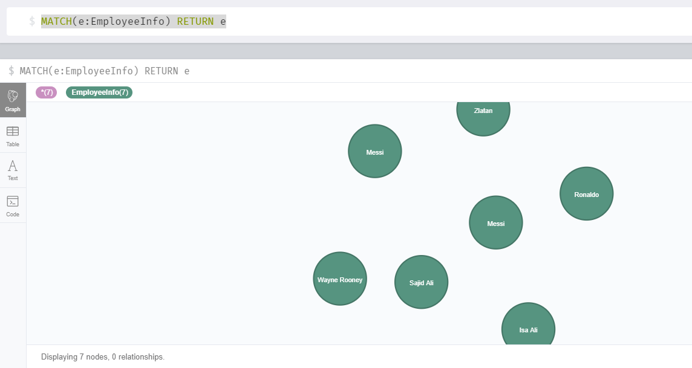

# Neo4j Spring data Rest API

Using Neo4j graph data and Spring tools to create an application that will allow users to interact with graph data from the web interface. Please download this project locally and run directly in Eclipse. 

The primary goal of the Spring Data project is to make it easier to build Spring-powered applications that use new data access technologies such as non-relational databases, map-reduce frameworks, and cloud based data services.
Spring data makes it easy to use data access technologies, relational and non-relational databases, map-reduce frameworks and cloud-based data services.

# Spring Data Neo4J
Provides support for the Neo4j Graph Database including annotated plan old Java objects (POJOs), SD-Repositories and Neo4j-Template.
It also offers advanced features to map annotated entity classes to the Neo4j Graph database. Spring Data Neo4j is core part of the Spring Data project which aims to provide convenient data access for NoSQL databases.
Spring Data Neo4j helps to write code as we would normally do in Spring but work with a graph database. It does this by using the Neo4j object-graph mapper (OGM) library, which takes a role like Hibernate in JPA, to interact with the drivers, and ultimately, the Neo4j graph database.

# What you will build
You will build a Spring application that lets you create and retrieve Employee objects that are stored in a Neo4j NoSQL database by using Spring Data REST. Spring Data REST takes the features of Spring HATEOS and Spring Data Neo4j and automatically combines them together. 

# Setup
  1. Your favourite IDE for Java (Eclipse, NetBeans etc)
  2. JDK 1.8 or later
  3. Maven 3.2+

# Neo4j Server
You need to set up Neo4j server to build this application. You can install Neo4j’s open source server for free. This example follows the local installation on a windows machine. You can also use Neo4jSandbox or a cloud hosted Neo4j database. If you chose second option, you need to provide the URL to your Neo4j server in an environment variable NEO4J_URL. 
Once you have installed the Neo4j server, you can start it with default setting by opening the “Neo4j Desktop” application. Default username and password for Neo4j are neo4j/neo4j. You can reset the password for database by going into Manage->Administration. 


# Spring Initializr
Spring initializr offers a fast way to create a skeleton for Spring Applications. It also enables to pull in all the dependencies you need and does a lot of setup for you. Our application requires “Rest Repositories” and “Spring Data Neo4j Dependencies”.


# POM.xml
```xml
The pom.xml will be created when you chose Maven and looks like this
<?xml version="1.0" encoding="UTF-8"?>
<project xmlns="http://maven.apache.org/POM/4.0.0" xmlns:xsi="http://www.w3.org/2001/XMLSchema-instance"
    xsi:schemaLocation="http://maven.apache.org/POM/4.0.0 https://maven.apache.org/xsd/maven-4.0.0.xsd">
    <modelVersion>4.0.0</modelVersion>
    <parent>
        <groupId>org.springframework.boot</groupId>
        <artifactId>spring-boot-starter-parent</artifactId>
        <version>2.2.2.RELEASE</version>
        <relativePath/> <!-- lookup parent from repository -->
    </parent>
    <groupId>com.employee</groupId>
    <artifactId>employee-neo4j-demo-rest-sa</artifactId>
    <version>0.0.1-SNAPSHOT</version>
    <name>employee-neo4j-demo-rest-sa</name>
    <description>Demo project for Spring Boot and Neo4j database</description>
    <properties>
        <java.version>1.8</java.version>
    </properties>

    <dependencies>
        <dependency>
            <groupId>org.springframework.boot</groupId>
            <artifactId>spring-boot-starter-data-neo4j</artifactId>
        </dependency>
        <dependency>
            <groupId>org.springframework.boot</groupId>
            <artifactId>spring-boot-starter-data-rest</artifactId>
        </dependency>
        <dependency>
            <groupId>org.springframework.boot</groupId>
            <artifactId>spring-boot-starter-test</artifactId>
            <scope>test</scope>
            <exclusions>
                <exclusion>
                    <groupId>org.junit.vintage</groupId>
                    <artifactId>junit-vintage-engine</artifactId>
                </exclusion>
            </exclusions>
        </dependency>
    </dependencies>
    <build>
        <plugins>
            <plugin>
                <groupId>org.springframework.boot</groupId>
                <artifactId>spring-boot-maven-plugin</artifactId>
            </plugin>
        </plugins>
    </build>
</project>
```
# Authentication
Neo4j server requires username and password to access it. This can be configured in the application.properties file


# Domain Class
To present an Employee we will create a domain as EmployeeInfo
package com.employee.neo4j.demo.rest;
```Java
import org.neo4j.ogm.annotation.GeneratedValue;
import org.neo4j.ogm.annotation.Id;
import org.neo4j.ogm.annotation.NodeEntity;
import org.neo4j.ogm.annotation.Relationship;

@NodeEntity
public class EmployeeInfo {    
    @Id @GeneratedValue private Long id;    
    private String employeeName;
    private int employeeId;
    public String getEmployeeName() {
        return employeeName;
    }
    public void setEmployeeName(String employeeName) {
        this.employeeName = employeeName;
    }
    public int getEmployeeId() {
        return employeeId;
    }
    public void setEmployeeId(int employeeId) {
        this.employeeId = employeeId;
    }
}
```
The EmployeeInfo has  employeeName and employeeId. There is also an id object which is configured to be automatically generated.

# Repository
We need to create a repository for Employee. A repository in an interface and lets you perform different operations that involves EmployeeInfo object. These operations are available by extending PagingAndSortingRepository interface defined in Spring Data Commons.
package com.employee.neo4j.demo.rest;
```Java
import org.springframework.data.repository.PagingAndSortingRepository;
import org.springframework.data.rest.core.annotation.RepositoryRestResource;
@RepositoryRestResource(collectionResourceRel = "employee", path = "employee")
public interface EmployeeRepo extends PagingAndSortingRepository<EmployeeInfo, Long> {    
    
}
```
At runtime, Spring Data REST automatically creates an implementation of this interface. Then it uses the @RepositoryRestResource annotation to direct Spring MVC to create RESTful endpoint at /employee. 

# Application Class
This is the entry point for our application.
```Java
package com.employee.neo4j.demo.rest;
import org.springframework.boot.SpringApplication;
import org.springframework.boot.autoconfigure.SpringBootApplication;
import org.springframework.data.neo4j.repository.config.EnableNeo4jRepositories;
import org.springframework.transaction.annotation.EnableTransactionManagement;

@EnableTransactionManagement
@EnableNeo4jRepositories
@SpringBootApplication
public class EmployeeNeo4jRestApplication {

    public static void main(String[] args) {
        SpringApplication.run(EmployeeNeo4jRestApplication.class, args);
    }
}
```
Three different annotations are used in application class. 
@SpringBootApplication	Adds following into our project.
  1. @Configuration Tags the class as a source of bean definitions for the application context.
  2. @EnableAutoConfiguration Tells Spring Boot to start adding beans based on classpath settings, other beans, and various property settings.
  3. @ComponentScan Tells Spring to look for other components, configurations, and services in the com/employee package, letting it find the controller.
The main() method uses Spring Boot SpringApplication.run to launch an application. 
@EnableNeo4jRepositories activates Spring Data Neo4j

The final project will look like this:



Now our application is ready to be executed. You can run the application with Maven. From eclipse you can run the application by using “./mvnw spring-boot:run”
Right click on project and select “Maven buid”



Then specify “spring-boot:run”in goal



# Test
Your application is up and running. You can test the application with any REST client. For this application I am using curl command
To see the top-level service run the following command
curl http://localhost:8080
```JSON
Response:

{
  "_links" : {
    "employee" : {
      "href" : "http://localhost:8080/employee{?page,size,sort}",
      "templated" : true
    },
    "profile" : {
      "href" : "http://localhost:8080/profile"
    }
  }
}
```
To see the list of all employee use this command
curl http://localhost:8080/employee

Initially there are no employees in our database. Use following command to add an employee
```curl
curl -i -X POST -H "Content-Type: application/json" -d "{\"employeeName\":\"Roony\", \"employeeId\" : \"55\" }" http://localhost:8080/employee
```

```JSON
Response:
HTTP/1.1 201
Vary: Origin
Vary: Access-Control-Request-Method
Vary: Access-Control-Request-Headers
Location: http://localhost:8080/employee/46
Content-Type: application/hal+json
Transfer-Encoding: chunked
Date: Sun, 15 Mar 2020 21:24:38 GMT

{
  "employeeName" : "Roony",
  "employeeId" : 55,
  "_links" : {
    "self" : {
      "href" : "http://localhost:8080/employee/46"
    },
    "employeeInfo" : {
      "href" : "http://localhost:8080/employee/46"
    }
  }
}
```
In response you can also see the URI of newly created employee. You can also use other REST calls for replace(PUT), update(PATCH) and delete(DELETE). Below curl command is used to replace the name of an employee, we created earlier. 
```curl
curl -i -X PUT -H "Content-Type: application/json" -d "{\"employeeName\":\"Wayne Rooney\", \"employeeId\" : \"20\" }" http://localhost:8080/employee/46
```
```JSON
Reposne:
HTTP/1.1 200
Vary: Origin
Vary: Access-Control-Request-Method
Vary: Access-Control-Request-Headers
Location: http://localhost:8080/employee/46
Content-Type: application/hal+json
Transfer-Encoding: chunked
Date: Sun, 15 Mar 2020 21:34:44 GMT

{
  "employeeName" : "Wayne Rooney",
  "employeeId" : 20,
  "_links" : {
    "self" : {
      "href" : "http://localhost:8080/employee/46"
    },
    "employeeInfo" : {
      "href" : "http://localhost:8080/employee/46"
    }
  }
```

You can also see the nodes being created in our Neo4J database. Run the following cypher query to see all employees in Neo4j browser
MATCH(e:EmployeeInfo) RETURN e


# Some useful links

https://spring.io/projects/spring-data-neo4j

https://spring.io/projects/spring-hateoas

https://neo4j.com/download/

https://start.spring.io/

